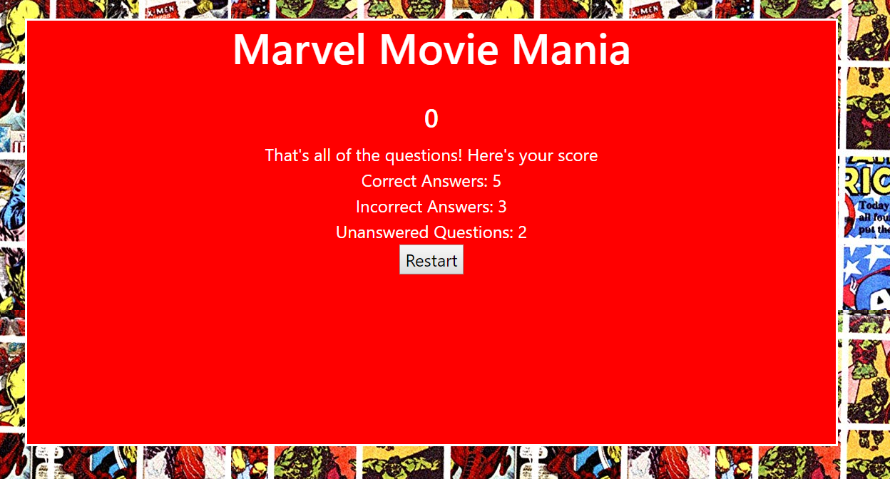

# Marvel Trivia
### Overview 
In this game the player will need to answer a series of ten Marvel themed trivia questions. The player is given a time limit to answer each question in the set.
### Question Outcomes
* Correct Answer
  * The player is informed that they answered correctly and this result is tallied
* Incorrect Answer
  * The player is informed of the correct answer and this result is tallied
* Time Out
  * The player is informed that they ran out of time, given the correct answer, and this result is tallied
  
No matter the outcome, the player will be shown a gif relating to the question
### End Game
After every question has been completed, the player will be shown the total **correct answers**, the total **incorrect answers**, and the total **unanswered questions**. The player then has the option to play again. 

### Technical Aspects
#### Javascript & jQuery
The trivia questions are stored in an array called **questions** where each question is an object with the following properties: **q**, **correctAnswer**, **incorrectAnswers**, and **gif**
##### Example
```javascript
{
  q: "What is the name of Tony Stark's personal butler?",
  correctAnswer: "Jarvis",
  incorrectAnswers: ["Alfred", "Jeeves", "Hal" ],
  gif: "jarvis.gif"
  }
```
Question objects from the array are assigned to a variable **currentQuestion** with the **assignQuestion()** function 
```javascript
var currentQuestion = {
    disQ: " ",
    answers: [
        " ", " ", " ", " "
    ],
    timeleft: 15,
    funGif: " ",
    assignAnswer: function (ans){
        var index = Math.floor(Math.random()* 4);
        if (this.answers[index] === " "){
            this.answers[index] = ans;
        }
        else{
            this.assignAnswer(ans);
        }
    }
}
```
**assignAnswer(ans)** will be used to assign the **correctAnswer** and **incorrectAnswers** from the question object to a random index in the **answers** array of **currentQuestion**.
```javascript
var assignQuestion = function(){
    for (k = 0; k < 4; k++){
        currentQuestion.answers[k] = " ";
    }
    currentQuestion.disQ = questions[questionIndex].q;
    currentQuestion.assignAnswer(questions[questionIndex].correctAnswer);
    for ( i = 0; i < 3; i++){
        currentQuestion.assignAnswer(questions[questionIndex].incorrectAnswers[i]);
    }
    $("#question").empty();
    $("#question-gif").empty();
    $("#question").append("<div class='row'><div class='col'>" + currentQuestion.disQ + "</div></div>");
    var val = 0;
    for (j = 0; j < 4; j++){
            if (currentQuestion.answers[j] === questions[questionIndex].correctAnswer){
                val = 1;
                correctInd = j;
            }
            else{
                val = 0;
            }
            $("#question").append("<div class='row'><div class='col'><button class='playerAns' value =" + val + ">" +
            currentQuestion.answers[j] + "</button></div></div>");
    }
    currentQuestion.timeleft =15;
    $("#timer").html("<h4>" + currentQuestion.timeleft + "</h4>");
    timer();
}
```
After a question object from the **questions** array is assigned to **currentQuestion**, jQuery is used to update the question on the DOM. The correct answer is given a value of 1, and the incorrect answers are given a value of 0, wich will be important in determining the result of the question. Finally, the timer will be reset. 

Once this is complete the timer will run down until the player selects an answer. After the player selects their answer or after the timer runs out, the **questionResult()** function will be called with an argument based on the result. The DOM is updated with jQuery to reflect the result. Additionally a gif associated with the question will be shown to the player.
``` javascript
var questionResult = function(result){
    $("#question").empty();
    switch(result){
        case "correct":
            $("#question").append("<div class = 'row'><div class='col'>Correct!</div></div>");
            numCorrect++;
        break;
        case "incorrect":
            $("#question").append("<div class = 'row'><div class='col'>Incorrect!</div></div>");
            $("#question").append("<div class = 'row'><div class='col'>The correct answer was: " + currentQuestion.answers[correctInd] + "</div></div>");
            numIncorrect++;
            break;
        case "timeup":
            $("#question").append("<div class = 'row'><div class='col'>Time is up!</div></div>");
            $("#question").append("<div class = 'row'><div class='col'>The correct answer was: " + currentQuestion.answers[correctInd] + "</div></div>");
            numUnanswered++;
            break;
    }
    $("#question-gif").append("");
    questionIndex++;
    clearInterval(intervalId);
    if(questionIndex < questions.length){
        setTimeout(assignQuestion, 5000);
    }
    else{
        setTimeout(gameover, 5000);
    }
}
```
After 5 seconds the next question will be assigned. If there are no more questions the gameover screen will be displayed. 

#### Bootstrap 
The Bootstrap grid system is used for the layout. Additionally, the img-fluid class is utilized to make the game responsive. 
